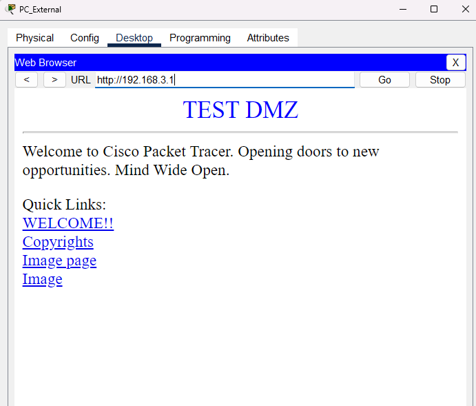
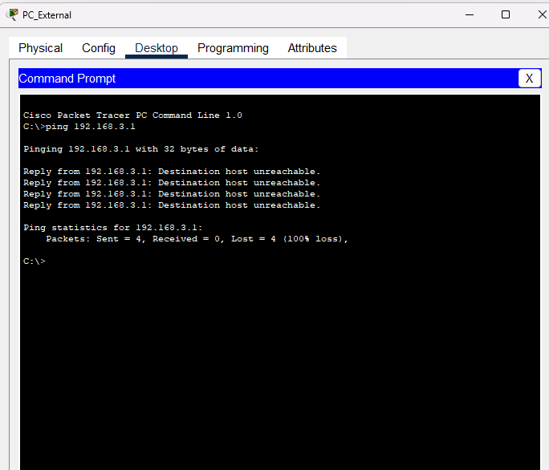
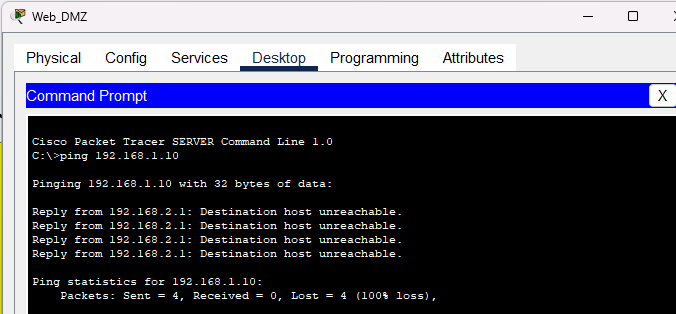
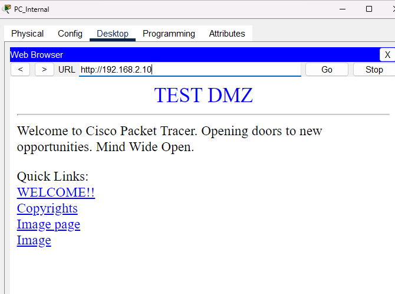
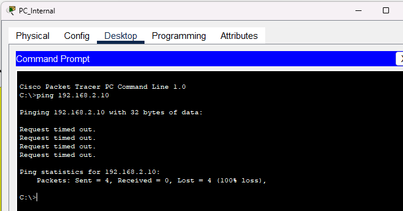

DMZ Configuration Report with Cisco Packet Tracer

1. Lab Objective
Configure a secure DMZ using a Cisco ISR router, applying NAT and ACLs to control traffic between LAN, DMZ, and the external network.

2. Implemented Topology

number of networks: 3
Devices used: 7
LAN NETWORK : isolated network from ICMP external network, and can access web server on DMZ area
DMZ area : configure web server, external or internal network can access
EXTERNAL NETWORK / WAN : can acess DMZ web server, but limited from ping internal network, use NAT access the DMZ

3. IP Addressing Plan
|Device	| IP | Mask | Gateway |
|:---:|:---:|:---:|:---:|
|PC_Internal | 192.168.1.10 | 255.255.255.0 | 192.168.1.1 |			
|Server_DMZ | 192.168.2.10 | 255.255.255.0 | 192.168.2.1 |		
|PC_External | 192.168.3.10 | 255.255.255.0 | 192.168.3.1 |
|Router_FW Gi0/0 (LAN) | 192.168.1.1 | 255.255.255.0 |  |			
|Router_FW Gi0/1 (DMZ) | 192.168.2.1 | 255.255.255.0 |  |			
|Router_FW Gi0/2 (Ext) | 192.168.3.1 | 255.255.255.0 |  |			

4. Applied Configuration (Summary)

Interfaces configured with ip address
NAT:
```Bash
ip nat inside source static 192.168.2.10 192.168.3.1  
```

ACLs:
for internal network/GigabitEthernet0/1
```Bash
ip access-list extended internal_network
permit tcp 192.168.2.0 0.0.0.255 192.168.1.0 0.0.0.255 established
deny ip 192.168.2.0 0.0.0.255 192.168.1.0 0.0.0.255
permit ip 192.168.2.0 0.0.0.255 any
exit
```

for external network/GigabitEthernet0/2
```Bash
ip access-list extended external_network
permit tcp any host 192.168.3.1 eq 80
exit
```

5. Verifications Performed

ping from PC_Internal to the router: ✅
Web access from PC_External: ✅
Blocking access from DMZ to LAN: ✅

6. Conclusions and Recommendations
I learned to apply NAT and ACLs in a simulated environment and learning DMZ. I recommend verifying basic connectivity before applying firewall rules, as an IP error can block everything.

7. Evidence Screenshots











