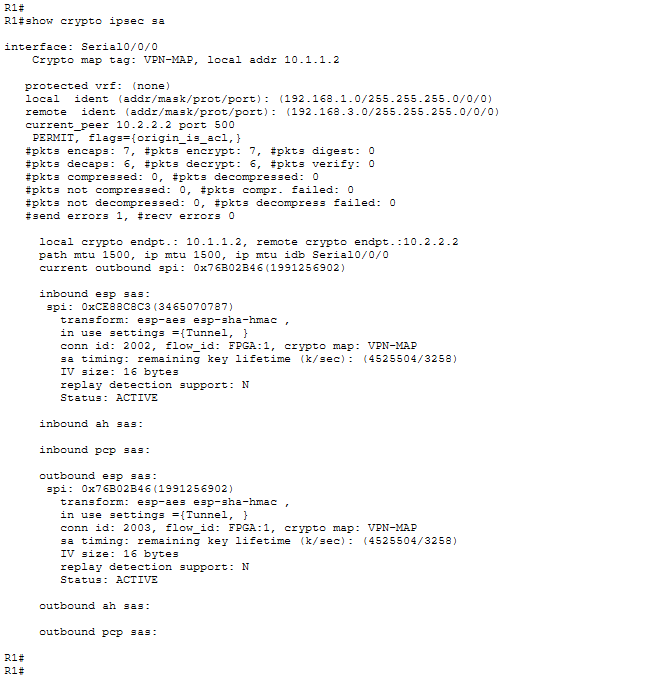

# Site-to-Site IPsec VPN

## 1. Lab Objective

• Verify connectivity throughout the network.
• Configure R1 to support a site-to-site IPsec VPN with R3.

## scenario

The network topology shows three routers. Your task is to configure R1 and R3 to support a site-to-site IPsec VPN when traffic flows between their respective LANs. The IPsec VPN tunnel is from R1 to R3 via R2. R2 acts as a pass-through and has no knowledge of the VPN. IPsec provides secure transmission of sensitive information over unprotected networks, such as the Internet. IPsec operates at the network layer and protects and authenticates IP packets between participating IPsec devices (peers), such as Cisco routers.

The routers have been pre-configured with the following:

• Password for console line: ciscoconpa55
• Password for vty lines: ciscovtypa55
• Enable password: ciscoenpa55
• SSH username and password: SSHadmin / ciscosshpa55
• OSPF 101

## 2. IP Addressing Table

| Device | Interface    | IP Address  | Subnet Mask     | Default Gateway | Switch Port |
| :----- | :----------- | :---------- | :-------------- | --------------- | ----------- |
| R1     | G0/0         | 192.168.1.1 | 255.255.255.0   | N/A             | S1 F0/1     |
| "      | S0/0/0 (DCE) | 10.1.1.2    | 255.255.255.252 | N/A             | N/A         |
| R2     | G0/0         | 192.168.2.1 | 255.255.255.0   | N/A             | S2 F0/2     |
| "      | S0/0/0       | 10.1.1.1    | 255.255.255.252 | N/A             | N/A         |
| "      | S0/0/1 (DCE) | 10.2.2.1    | 255.255.255.252 | N/A             | N/A         |
| R3     | G0/0         | 192.168.3.1 | 255.255.255.0   | N/A             | S3 F0/5     |
| "      | S0/0/1       | 10.2.2.2    | 255.255.255.252 | N/A             | N/A         |
| PC-A   | NIC          | 192.168.1.3 | 255.255.255.0   | 192.168.1.1     | S1 F0/2     |
| PC-B   | NIC          | 192.168.2.3 | 255.255.255.0   | 192.168.2.1     | S2 F0/1     |
| PC-B   | NIC          | 192.168.3.3 | 255.255.255.0   | 192.168.3.1     | S3 F0/18    |

## ISAKMP Phase 1 Policy Parameters

| Parameters              | Options                | R1        | R3        |
| :---------------------- | :--------------------- | :-------- | :-------- |
| Key Distribution Method | Manual or ISAKMP       | ISAKMP    | ISAKMP    |
| Encryption Algorithm    | DES, 3DES, or AES      | AES 256   | AES 256   |
| Hash Algorithm          | MD5 or SHA-1           | SHA-1     | SHA-1     |
| Authentication Method   | Pre-shared keys or RSA | pre-share | pre-share |
| Key Exchange            | DH Group 1, 2, or 5    | DH 5      | DH 5      |
| IKE SA Lifetime         | 86400 seconds or less  | 86400     | 86400     |
| ISAKMP Key              | -                      | vpnpa55   | vpnpa55   |

## IPsec Phase 2 Policy Parameters

| Parameters                   | R1                                                    | R3                                                    |
| :--------------------------- | :---------------------------------------------------- | :---------------------------------------------------- |
| Transform Set Name           | VPN-SET                                               | VPN-SET                                               |
| ESP Transform Encryption     | esp-aes                                               | esp-aes                                               |
| ESP Transform Authentication | esp-sha-hmac                                          | esp-sha-hmac                                          |
| Peer IP Address              | 10.2.2.2                                              | 10.1.1.2                                              |
| Traffice to be Encrypted     | access-list 110 (source 192.168.1.0 dest 192.168.3.0) | access-list 110 (source 192.168.3.0 dest 192.168.1.0) |
| Crypto Map Name              | VPN-MAP                                               | VPN-MAP                                               |
| SA Establishment             | ipsec-isakmp                                          | ipsec-isakmp                                          |

## configs

[Link](configs.txt)

## result

## lab practice source

[Link](https://itexamanswers.net/8-4-1-2-packet-tracer-configure-verify-site-site-ipsec-vpn-using-cli-answes.html)
