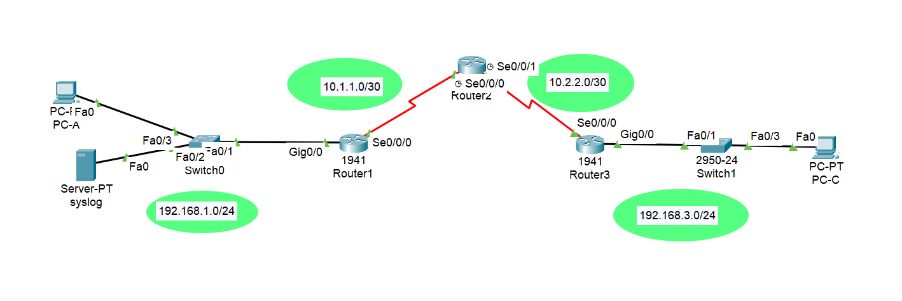

# Configure IOS Intrusion Prevention System (IPS)



## 1. Lab Objective

Configure IPS on R1 to scan traffic entering the 192.168.1.0 network. The server labeled Syslog is used to log IPS messages. Displaying the correct time and date in syslog messages is vital when using syslog to monitor the network. Set the clock and configure the timestamp service for logging on the routers. Finally, enable IPS to produce an alert and drop ICMP echo reply packets inline.
The server and PCs have been preconfigured. The routers have also been preconfigured with the following:

• static routing

## 2. IP Addressing Plan

| Device | Interface    | IP Address   | Subnet Mask     |
| :----- | :----------- | :----------- | :-------------- |
| R1     | G0/0         | 192.168.1.1  | 255.255.255.0   |
| "      | S0/0/0       | 10.1.1.1     | 255.255.255.252 |
| R2     | S0/0/0 (DCE) | 10.1.1.2     | 255.255.255.252 |
| "      | S0/0/1 (DCE) | 10.2.2.2     | 255.255.255.252 |
| R3     | S0/0/0       | 10.2.2.1     | 255.255.255.252 |
| "      | G0/0         | 192.168.3.1  | 255.255.255.0   |
| syslog | NIC          | 192.168.1.50 | 255.255.255.0   |
| PC-A   | NIC          | 192.168.1.2  | 255.255.255.0   |
| PC-B   | NIC          | 192.168.3.2  | 255.255.255.0   |

## 3. Applied Configuration (Summary)

### enable security Technology packet

```Bash
R1(config)# license boot module c1900 technology-package securityk9

On R1, issue the show version command to view the Technology Package license information.
```

### Create an IOS IPS configuration directory in flash.

On R1, create a directory in flash using the **mkdir** command. Name the directory **ipsdir**.

```Bash
R1# mkdir ipsdir
Create directory filename [ipsdir]? <Enter>
Created dir flash:ipsdir
```

### Configure the IPS signature storage location

On R1, configure the IPS signature storage location to be the directory that created.

```Bash
R1(config)# ip ips config location flash:ipsdir
```

### Create an IPS rule.

On R1, create an IPS rule name using the **ip ips name** name command in global configuration mode. Name the IPS rule iosips.

```Bash
R1(config)# ip ips name iosips
```

### Enable logging.

IOS IPS supports the use of syslog to send event notification. Syslog notification is enabled by default. If logging console is enabled, IPS syslog messages display.

#### a. Enable syslog if it is not enabled.

```Bash
R1(config)# ip ips notify log
```

#### b. If necessary, use the **clock set** command from privileged EXEC mode to reset the clock.

```Bash
R1# clock set 11:20:00 10 May 2025
```

#### c. Verify that the timestamp service for logging is enabled on the router using the show run command. Enable the timestamp service if it is not enabled.

```Bash
R1(config)# service timestamps log datetime msec
```

#### d. Send log messages to the syslog server at IP address 192.168.1.50.

```Bash
R1(config)# logging host 192.168.1.50
```

### Configure IOS IPS to use the signature categories.

Retire the **all** signature category with the **retired true** command (all signatures within the signature release). Unretire the **IOS_IPS Basic** category with the **retired false** command.

```Bash
R1(config)# ip ips signature-category
R1(config-ips-category)# category all
R1(config-ips-category-action)# retired true
R1(config-ips-category-action)# exit
R1(config-ips-category)# category ios_ips basic
R1(config-ips-category-action)# retired false
R1(config-ips-category-action)# exit
R1(config-ips-cateogry)# exit
Do you want to accept these changes? [confirm] <Enter>
```

### Apply the IPS rule to an interface.

Apply the IPS rule to an interface with the **ip ips name** direction command in interface configuration mode. Apply the rule outbound on the G0/0 interface of **R1**. After you enable IPS, some log messages will be sent to the console line indicating that the IPS engines are being initialized.

**Note:** The direction **in** means that IPS inspects only traffic going into the interface. Similarly, **out** means that IPS inspects only traffic going out of the interface.

```Bash
R1(config)# interface g0/0
R1(config-if)# ip ips iosips out
```

### Modify the Signature

#### Change the event-action of a signature.

Un-retire the echo request signature (signature 2004, subsig ID 0), enable it, and change the signature action to alert and drop.

```Bash
R1(config)# ip ips signature-definition
R1(config-sigdef)# signature 2004 0
R1(config-sigdef-sig)# status
R1(config-sigdef-sig-status)# retired false
R1(config-sigdef-sig-status)# enabled true
R1(config-sigdef-sig-status)# exit
R1(config-sigdef-sig)# engine
R1(config-sigdef-sig-engine)# event-action produce-alert
R1(config-sigdef-sig-engine)# event-action deny-packet-inline
R1(config-sigdef-sig-engine)# exit
R1(config-sigdef-sig)# exit
R1(config-sigdef)# exit
Do you want to accept these changes? [confirm] <Enter>
```

#### Use show commands to verify IPS.

Use the **show ip ips all** command to view the IPS configuration status summary.
To which interfaces and in which direction is the iosips rule applied?

**G0/0 outbound**

```Bash
show ip ips all
```

#### Verify that IPS is working properly.

a. From **PC-C**, attempt to ping **PC-A**. Were the pings successful? Explain.

_The pings should fail. This is because the IPS rule for event-action of an echo request was set to “denypacket-inline”._

b. From **PC-A**, attempt to ping **PC-C**. Were the pings successful? Explain.

_The ping should be successful. This is because the IPS rule does not cover echo reply. When PC-A pings PC-C, PC-C responds with an echo reply._

#### View the syslog messages.

a. Click the **Syslog** server.

b. Select the **Services** tab.

c. In the left navigation menu, select **SYSLOG** to view the log file.
