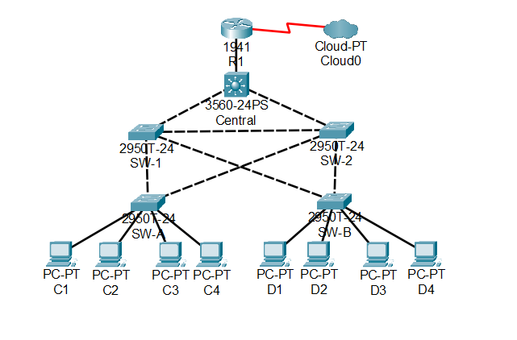

# CLayer 2 Security



## 1. Lab Objective

• Assign the Central switch as the root bridge.
• Secure spanning-tree parameters to prevent STP manipulation attacks.
• Enable port security to prevent CAM table overflow attacks.

## scenario

number of attack on the network recently. For this reason, the network administrator assigned you to configuring layer 2 security.

For optimum performance and security, the administrator would like to ensure that the root bridge is the 3560 Central switch. To prevent spanning-tree manipulation attacks, the administrator wants to ensure that the STP parameters are secure. To prevent against CAM table overflow attacks, the network administrator has decided to configure port security to limit the number of MAC addresses each switch port can learn. If the number of MAC addresses exceeds the set limit, the administrator would like the port to be shutdown.

All switch devices have been preconfigured with the following:

• Enable password: **ciscoenpa55**
• Console password: **ciscoconpa55**
• SSH username and password:**SSHadmin / ciscosshpa55**

## 3. Applied Configuration (Summary)

### Determine the current root bridge.

From **Central**, issue the **show spanning-tree** command to determine the current root bridge, to see the ports in use, and to see their status. SW-1 as the switch root bridge.

Based on the SW-1 as the root bridge the result of spanning tree like this

```Bash
====================================================================
                        [ ROOT BRIDGE ]
                       ( Switch Central )
               (All Port = Designated / Forwarding)
====================================================================
                         |                 |
                    (DP) |                 | (DP)
                         |                 |
                    (RP) v                 v (RP)
                  [ SW-1 ] ---(DP) (BLK)--- [ SW-2 ]
                   /    \                   /    \
                  /      \                 /      \
            (DP) /        \ (DP)     (DP) /        \ (DP)
                /          \             /          \
               /            \           /            \
          (RP)v          (RP)v     (BLK)v          (BLK)v
       [ SW-A ]             [ SW-B ]               ( the alternatif way
  (connected to C1-C4)  (connected to D1-D4)        to SW-A & SW-B
                                                   blocked by STP)
====================================================================

 PORT ROLE:
[DP] = Designated Port  (Status: Forwarding / Green)   - sending data down .
[RP] = Root Port        (Status: Forwarding / Green)   - fastest route to root.
[BLK]= Blocked/Alt Port (Status: Blocking / Orange)    - Block port.

*designed by gemini :)
```

### Assign Central as the primary root bridge.

Using the s**panning-tree vlan 1 root primary** command, and assign **Central** as the root bridge.

```Bash
Central(config)# spanning-tree vlan 1 root primary
```

### Assign SW-1 as a secondary root bridge.

Assign **SW-1** as the secondary root bridge using the **spanning-tree vlan 1 root secondary** command.

```Bash
SW-1(config)# spanning-tree vlan 1 root secondary
```

### Verify the spanning-tree configuration.

Issue the **show spanning-tree** command to verify that **Central** is the root bridge.

```Bash
Central# show spanning-tree
VLAN0001
  Spanning tree enabled protocol ieee
  Root ID    Priority    24577
             Address     00D0.D31C.634C
             This bridge is the root
             Hello Time  2 sec  Max Age 20 sec  Forward Delay 15 sec

  Bridge ID  Priority    24577  (priority 24576 sys-id-ext 1)
             Address     00D0.D31C.634C
             Hello Time  2 sec  Max Age 20 sec  Forward Delay 15 sec
             Aging Time  20
```

Based on the new root bridge the result of spanning tree like this

```Bash
====================================================================
                        [ PRIMARY ROOT ]
                       ( Switch Central )
                        Priority: 24577
               (All Port = Designated / Forwarding)
====================================================================
                         |                 |
                    (DP) |                 | (DP)
                         |                 |
                    (RP) v                 v (RP)
                  [ SW-1 ] ---(DP) (BLK)--- [ SW-2 ]
              SECONDARY ROOT                  DEFAULT
             Priority: 28673              Priority: 32769
                   /    \                   /    \
                  /      \                 /      \
            (DP) /        \ (DP)     (BLK)/        \(BLK)
                /          \             /          \
               /            \           /            \
          (RP)v          (RP)v         v            v
       [ SW-A ]             [ SW-B ]   (All Uplink from SW-A &
   Priority: 32769      Priority: 32769   SW-B to SW-2 blocked)
====================================================================

PORT ROLE:
[DP] = Designated Port (Green) - sending data.
[RP] = Root Port       (Green) - Main route to root.
[BLK]= Blocked Port    (Orange)- Backup route (temporary disconnect).

*designed by gemini :)
```

### Protect Against STP Attacks

Secure the STP parameters to prevent STP manipulation attacks.

#### Enable PortFast on all access ports.

PortFast is configured on access ports that connect to a single workstation or server to enable them to become active more quickly. On the connected access ports of the SW-A and SW-B, use the **spanning-tree portfast** command.

```Bash
SW-A(config)# interface range f0/1 - 4
SW-A(config-if-range)# spanning-tree portfast

SW-B(config)# interface range f0/1 - 4
SW-B(config-if-range)# spanning-tree portfast
```

#### Enable BPDU guard on all access ports.

BPDU guard is a feature that can help prevent rogue switches and spoofing on access ports. Enable BPDU guard on **SW-A** and **SW-B** access ports.

```Bash
SW-A(config)# interface range f0/1 - 4
SW-A(config-if-range)# spanning-tree bpduguard enable

SW-B(config)# interface range f0/1 - 4
SW-B(config-if-range)# spanning-tree bpduguard enable
```

**Note**: Spanning-tree BPDU guard can be enabled on each individual port using the **spanning-tree bpduguard enable** command in interface configuration mode or the **spanning-tree portfast bpduguard default** command in global configuration mode. For grading purposes in this activity, please use the **spanning-tree bpduguard enable** command.

#### Enable root guard.

Root guard can be enabled on all ports on a switch that are not root ports. It is best deployed on ports that connect to other non-root switches. Use the **show spanning-tree** command to determine the location of the root port on each switch.

On **SW-1**, enable root guard on ports F0/23 and F0/24.

On **SW-2**, enable root guard on ports F0/23 and F0/24.

```Bash
SW-1(config)# interface range f0/23 - 24
SW-1(config-if-range)# spanning-tree guard root

SW-2(config)# interface range f0/23 - 24
SW-2(config-if-range)# spanning-tree guard root
```

### Configure Port Security and Disable Unused Ports

#### Configure basic port security on all ports connected to host devices.

This procedure should be performed on all access ports on **SW-A** and **SW-B**. Set the maximum number of learned MAC addresses to **2**, allow the MAC address to be learned dynamically, and set the violation to **shutdown**.

**Note**: A switch port must be configured as an access port to enable port security.

```Bash
SW-A(config)# interface range f0/1 - 22
SW-A(config-if-range)# switchport mode access
SW-A(config-if-range)# switchport port-security
SW-A(config-if-range)# switchport port-security maximum 2
SW-A(config-if-range)# switchport port-security violation shutdown
SW-A(config-if-range)# switchport port-security mac-address sticky

SW-B(config)# interface range f0/1 - 22
SW-B(config-if-range)# switchport mode access
SW-B(config-if-range)# switchport port-security
SW-B(config-if-range)# switchport port-security maximum 2
SW-B(config-if-range)# switchport port-security violation shutdown
SW-B(config-if-range)# switchport port-security mac-address sticky
```

port security not enabled on ports that are connected to other switch devices because :

**Ports connected to other switch devices have a multitude of MAC addresses learned for that single port.**

**Limiting the number of MAC addresses that can be learned on these ports can significantly impact network functionality.**

#### Verify port security.

a. On **SW-A**, issue the command **show port-security interface f0/1** to verify that port security has been configured.

```Bash
W-A#sh port-security int f0/1
Port Security              : Enabled
Port Status                : Secure-up
Violation Mode             : Shutdown
Aging Time                 : 0 mins
Aging Type                 : Absolute
SecureStatic Address Aging : Disabled
Maximum MAC Addresses      : 2
Total MAC Addresses        : 0
Configured MAC Addresses   : 0
Sticky MAC Addresses       : 0
Last Source Address:Vlan   : 0000.0000.0000:0
Security Violation Count   : 0
```

b. Ping from **C1** to **C2** and issue the command **show port-security interface f0/1** again to verify that the switch has learned the MAC address for **C1**.

#### Disable unused ports.

Disable all ports that are currently unused.

```Bash
SW-A(config)# interface range f0/5 - 22
SW-A(config-if-range)# shutdown

SW-B(config)# interface range f0/5 - 22
SW-B(config-if-range)# shutdown
```

#### Check results.

Your completion percentage should be 100%. Click **Check Results** to view feedback and verification of which of the required components have been completed.

### lab practice source

[Link](https://itexamanswers.net/6-3-1-2-packet-tracer-layer-2-security-answers.html)
