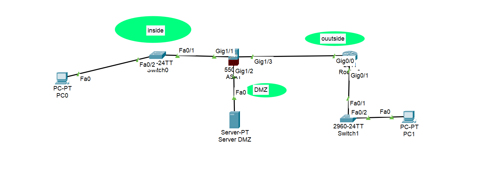

# FIREWALL Configuration Report with Cisco Packet Tracer



## 1. Lab Objective

Configure a secure network using a ASA (Adaptive Security Appliance) Cisco, applying NAT and ACLs to control traffic between LAN, DMZ, and the external network.

## 2. IP Addressing Plan

|     Device      |     IP      |     Mask      |   Gateway   |
| :-------------: | :---------: | :-----------: | :---------: |
|   PC_Internal   | 192.168.1.2 | 255.255.255.0 | 192.168.1.1 |
|   Server_DMZ    | 192.168.2.3 | 255.255.255.0 | 192.168.2.1 |
|   PC_External   |  90.0.0.3   | 255.255.255.0 |  90.0.0.1   |
|  Router gi0/0   |  200.0.0.1  | 255.255.255.0 |             |
|  Router gi0/1   |  90.0.0.10  | 255.255.255.0 |             |
| ASA Gi1/1 (LAN) | 192.168.1.1 | 255.255.255.0 |             |
| ASA Gi1/2 (DMZ) | 192.168.2.1 | 255.255.255.0 |             |
| ASA Gi1/3 (Ext) | 200.0.0.10  | 255.255.255.0 |             |

## 3. Applied Configuration (Summary)

### Interfaces configured with ip address

```Bash
interface GigabitEthernet0/0
 nameif outside
 security-level 0
 ip address 200.0.0.10 255.255.255.0
 no shutdown

interface GigabitEthernet0/1
 nameif inside
 security-level 100
 ip address 192.168.1.1 255.255.255.0
 no shutdown

interface GigabitEthernet0/2
 nameif dmz
 security-level 50
 ip address 192.168.2.1 255.255.255.0
 no shutdown
```

### NAT:

```Bash
object network DMZ-SERVER
 host 192.168.2.3
 nat (dmz,outside) static 200.0.0.20
```

### ACLs:

for external network

```Bash
access-list OUTSIDE-TO-DMZ extended permit tcp any host 192.168.2.3 eq 80
access-list OUTSIDE-TO-DMZ extended permit tcp any host 192.168.2.3 eq 443
access-group OUTSIDE-TO-DMZ in interface outside
exit
```

for DMZ server
This happen because of some bug that need to write ACL for inside network. But if working with the actual or other lab like PNET this should not be written.
firewall asa read security level, and when DMZ to internal network, the internal security level is trusted by DMZ and only write for outside because security level is 0 or untrusted.

```Bash
access-list DMZ-TO-INSIDE extended permit tcp host 192.168.2.3 eq 80 192.168.1.0 255.255.255.0
access-group DMZ-TO-INSIDE in interface dmz
```

### Default Route:

```Bash
route outside 0.0.0.0 0.0.0.0 200.0.0.1
```
