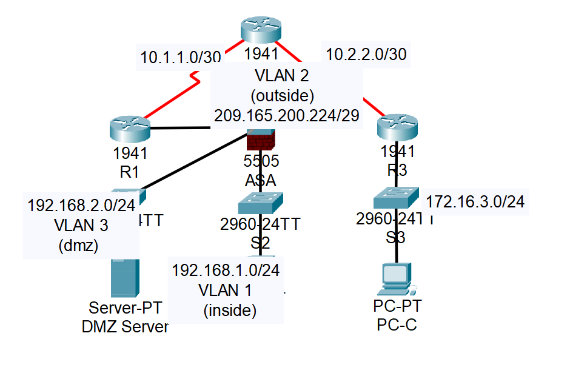

# ASA Basic Settings and Firewall



## 1. Lab Objective

- Verify connectivity and explore the ASA

- Configure basic ASA settings and interface security levels using CLI

- Configure routing, address translation, and inspection policy using CLI

- Configure DHCP, AAA, and SSH

- Configure a DMZ, Static NAT, and ACLs

## 2. Ip Addressing Table

|   Device   |   Interface   |       IP        |      Mask       |   Gateway   |
| :--------: | :-----------: | :-------------: | :-------------: | :---------: |
|     R1     |     G0/0      | 209.165.200.225 | 255.255.255.248 |     N/A     |
|     "      | S0/0/0 (DCE)  |    10.1.1.1     | 255.255.255.252 |     N/A     |
|     R2     |    S0/0/0     |    10.1.1.2     | 255.255.255.252 |     N/A     |
|     "      | S0/0/1 (DCE)  |    10.2.2.2     | 255.255.255.252 |     N/A     |
|     R3     |     G0/1      |   172.16.3.1    |  255.255.255.0  |     N/A     |
|     "      |    S0/0/1     |    10.2.2.1     | 255.255.255.252 |     N/A     |
|    ASA     | VLAN 1 (E0/1) |   192.168.1.1   |  255.255.255.0  |     N/A     |
|    ASA     | VLAN 2 (E0/0) | 209.165.200.226 | 255.255.255.248 |     N/A     |
|    ASA     | VLAN 3 (E0/2) |   192.168.2.1   |  255.255.255.0  |     N/A     |
| DMZ Server |      NIC      |   192.168.2.3   |  255.255.255.0  | 192.168.2.1 |
|    PC-B    |      NIC      |   192.168.1.3   |  255.255.255.0  | 192.158.1.1 |
|    PC-C    |      NIC      |   172.16.3.3    |  255.255.255.0  | 172.16.3.1  |

## 2. scenario

Your company has one location connected to an ISP. R1 represents a CPE device managed by the ISP. R2 represents an intermediate Internet router. R3 represents an ISP that connects an administrator from a network management company, who has been hired to remotely manage your network. The ASA is an edge CPE security device that connects the internal corporate network and DMZ to the ISP while providing NAT and DHCP services to inside hosts. The ASA will be configured for management by an administrator on the internal network and by the remote administrator. Layer 3 VLAN interfaces provide access to the three areas created in the activity: Inside, Outside, and DMZ. The ISP assigned the public IP address space of 209.165.200.224/29, which will be used for address translation on the ASA.

All router and switch devices have been preconfigured with the following:

- Enable password: **ciscoenpa55**
- Console password: **ciscoconpa55**
- Admin username and password: admin/**adminpa55**

**Note**: This Packet Tracer activity is not a substitute for the ASA labs. This activity provides additional practice and simulates most of the ASA 5505 configurations. When compared to a real ASA 5505, there may be slight differences in command output or commands that are not yet supported in Packet Tracer.

## 3. Applied Configuration (Summary)

### Part 1: Verify Connectivity and Explore the ASA.

#### Step 1: Verify connectivity

The ASA is not currently configured. However, all routers, PCs, and the DMZ server are configured. Verify that PC-C can ping any router interface. PC-C is unable to ping the ASA, PC-B, or the DMZ server.

#### Step 2: Determina the ASA version, interfaces, and license

Use the **show version** command to determine various aspects of this ASA device.

#### Step 3: Determine the file system and contents of flash memory

- a. Enter privileged EXEC mode. A password has not been set. Press Enter when prompted for a password.
- b. Use the show file system command to display the ASA file system and determine which prefixes are supported.
- c. Use the show flash: or show disk0: command to display the contents of flash memory.

### Part 2: Configure ASA Settings and Interface Security Using the CLI

#### Step 1: Configure the hostname and domain name

- a. Configure the ASA hostname as **CCNAS-ASA**.
- b. Configure the domain name as **ccnasecurity.com**.

#### Step 2: Configure the enable mode password.

Use the **enable password** command to change the privileged EXEC mode password to **ciscoenpa55**.

#### Step 3: Set the date and time.

Use the clock set command to manually set the date and time (this step is not scored).

#### Step 4: Configure the inside and outside interfaces

You will only configure the VLAN 1 (inside) and VLAN 2 (outside) interfaces at this time. The VLAN 3 (dmz) interface will be configured in Part 5 of the activity.

- a. Configure a logical VLAN 1 interface for the inside network (192.168.1.0/24) and set the security level to the highest setting of 100.

```bash
CCNAS-ASA(config)# interface vlan 1
CCNAS-ASA(config-if)# nameif inside
CCNAS-ASA(config-if)# ip address 192.168.1.1 255.255.255.0
CCNAS-ASA(config-if)# security-level 100
```

- b. Create a logical VLAN 2 interface for the outside network (209.165.200.224/29), set the security level to the lowest setting of 0, and enable the VLAN 2 interface.

```Bash
CCNAS-ASA(config-if)# interface vlan 2
CCNAS-ASA(config-if)# nameif outside
CCNAS-ASA(config-if)# ip address 209.165.200.226 255.255.255.248
CCNAS-ASA(config-if)# security-level 0
```

- c. Use the following verification commands to check your configurations:
  - 1.  Use the **show interface ip brief** command to display the status for all ASA interfaces. **Note**: This command is different from the IOS command **show ip interface brief**. If any of the physical or logical interfaces previously configured are not up/up, troubleshoot as necessary before continuing.
  - **Tip**: Most ASA **show** commands, including **ping, copy**, and others, can be issued from within any configuration mode prompt without the **do** command.
  * 2.  Use the **show ip address** command to display the information for the Layer 3 VLAN interfaces.

  * 3.  Use the **show switch vlan** command to display the inside and outside VLANs configured on the ASA and to display the assigned ports.

#### Step 5: Test Connectivity to the ASA

- a. You should be able to ping from PC-B to the ASA inside interface address (192.168.1.1). If the pings fail, troubleshoot the configuration as necessary.

- b. From PC-B, ping the VLAN 2 (outside) interface at IP address 209.165.200.226. You should not be able to ping this address.

### Part 3 Configure Routing, Address Translation, and Inspection Policy

#### Step 1: Configure a statuc default route for the ASA

Configure a default static route on the ASA outside interface to enable the ASA to reach external networks.

- Create a “quad zero” default route using the **route** command, associate it with the ASA outside interface, and point to the R1 G0/0 IP address (209.165.200.225) as the gateway of last resort.

```Bash
CCNAS-ASA(config)# route outside 0.0.0.0 0.0.0.0 209.165.200.225
```

- Issue the **show route** command to verify the static default route is in the ASA routing table.

- Verify that the ASA can ping the R1 S0/0/0 IP address 10.1.1.1. If the ping is unsuccessful, troubleshoot as necessary.

#### Step 2: Configure address translation using PAT and network objects.

- Create network object **inside-net** and assign attributes to it using the **subnet** and **nat** commands.

```Bash
CCNAS-ASA(config)# object network inside-net
CCNAS-ASA(config-network-object)# subnet 192.168.1.0 255.255.255.0
CCNAS-ASA(config-network-object)# nat (inside,outside) dynamic interface
CCNAS-ASA(config-network-object)# end
```

- The ASA splits the configuration into the object portion that defines the network to be translated and the actual **nat** command parameters. These appear in two different places in the running configuration. Display the NAT object configuration using the **show run** command.

- The ASA splits the configuration into the object portion that defines the network to be translated and the actual nat command parameters. These appear in two different places in the running configuration. Display the NAT object configuration using the show run command.

- Issue the **show nat** command on the ASA to see the translated and untranslated hits. Notice that, of the pings from PC-B, four were translated and four were not. The outgoing pings (echos) were translated and sent to the destination. The returning echo replies were blocked by the firewall policy. Configure the default inspection policy to allow ICMP in Step 3 of this part of the activity.

#### Step 3: Modify the default MPF application inspection global service policy.

For application layer inspection and other advanced options, the Cisco MPF is available on ASAs.

The Packet Tracer ASA device does not have an MPF policy map in place by default. As a modification, we can create the default policy map that will perform the inspection on inside-to-outside traffic. When configured correctly only traffic initiated from the inside is allowed back in to the outside interface. You will need to add ICMP to the inspection list.

- Create the class-map, policy-map, and service-policy. Add the inspection of ICMP traffic to the policy map list using the following commands:

```Bash
CCNAS-ASA(config)# class-map inspection_default
CCNAS-ASA(config-cmap)# match default-inspection-traffic
CCNAS-ASA(config-cmap)# exit
CCNAS-ASA(config)# policy-map global_policy
CCNAS-ASA(config-pmap)# class inspection_default
CCNAS-ASA(config-pmap-c)# inspect icmp
CCNAS-ASA(config-pmap-c)# exit
CCNAS-ASA(config)# service-policy global_policy global
```

- From PC-B, attempt to ping the R1 G0/0 interface at IP address 209.165.200.225. The pings should be successful this time because ICMP traffic is now being inspected and legitimate return traffic is being allowed. If the pings fail, troubleshoot your configurations.

### Part 4: Configure DHCP, AAA, and SSH

#### Step 1: Configure the ASA as a DHCP server

- Configure a DHCP address pool and enable it on the ASA inside interface.

```Bash
CCNAS-ASA(config)# dhcpd address 192.168.1.5-192.168.1.36 inside
```

- (Optional) Specify the IP address of the DNS server to be given to clients.

```Bash
CCNAS-ASA(config)# dhcpd dns 209.165.201.2 interface inside
```

- Enable the DHCP daemon within the ASA to listen for DHCP client requests on the enabled interface (inside).

```Bash
CCNAS-ASA(config)# dhcpd enable inside
```

- Change PC-B from a static IP address to a DHCP client, and verify that it receives IP addressing information. Troubleshoot, as necessary to resolve any problems.

#### Step 2: Configure AAA to use the local database for authentication.

- Define a local user named admin by entering the username command. Specify a password of **adminpa55**.

```Bash
CCNAS-ASA(config)# username admin password adminpa55
```

- Configure AAA to use the local ASA database for SSH user authentication.

```Bash
CCNAS-ASA(config)# aaa authentication ssh console LOCAL
```

#### Step 3: Configure remote access to the ASA.

The ASA can be configured to accept connections from a single host or a range of hosts on the inside or outside network. In this step, hosts from the outside network can only use SSH to communicate with the ASA. SSH sessions can be used to access the ASA from the inside network

- Generate an RSA key pair, which is required to support SSH connections. Because the ASA device has RSA keys already in place, enter no when prompted to replace them.

```Bash
CCNAS-ASA(config)# crypto key generate rsa modulus 1024
WARNING: You have a RSA keypair already defined named <Default-RSA-Key>.

Do you really want to replace them? [yes/no]: no
ERROR: Failed to create new RSA keys named <Default-RSA-Key>
```

- Configure the ASA to allow SSH connections from any host on the inside network (192.168.1.0/24) and from the remote management host at the branch office (172.16.3.3) on the outside network. Set the SSH timeout to 10 minutes (the default is 5 minutes).

```Bash
CCNAS-ASA(config)# ssh 192.168.1.0 255.255.255.0 inside
CCNAS-ASA(config)# ssh 172.16.3.3 255.255.255.255 outside
CCNAS-ASA(config)# ssh timeout 10
```

- Establish an SSH session from PC-C to the ASA (209.165.200.226). Troubleshoot if it is not successful.

```Bash
PC> ssh -l admin 209.165.200.226
```

- Establish an SSH session from PC-B to the ASA (192.168.1.1). Troubleshoot if it is not successful.

```Bash
PC> ssh -l admin 192.168.1.1
```

### Part 5: Configure a DMZ, Static NAT, and ACLs

R1 G0/0 and the ASA outside interface already use 209.165.200.225 and .226, respectively. You will use public address 209.165.200.227 and static NAT to provide address translation access to the server.

#### Step 1: Configure the DMZ interface VLAN 3 on the ASA.

- Configure DMZ VLAN 3, which is where the public access web server will reside. Assign it IP address 192.168.2.1/24, name it **dmz**, and assign it a security level of 70. Because the server does not need to initiate communication with the inside users, disable forwarding to interface VLAN 1.

```Bash
CCNAS-ASA(config)# interface vlan 3
CCNAS-ASA(config-if)# ip address 192.168.2.1 255.255.255.0
CCNAS-ASA(config-if)# no forward interface vlan 1
CCNAS-ASA(config-if)# nameif dmz
INFO: Security level for "dmz" set to 0 by default.
CCNAS-ASA(config-if)# security-level 70
```

- Assign ASA physical interface E0/2 to DMZ VLAN 3 and enable the interface.

```Bash
CCNAS-ASA(config-if)# interface Ethernet0/2
CCNAS-ASA(config-if)# switchport access vlan 3
```

- Use the following verification commands to check your configurations:
  - Use the **show interface ip brief** command to display the status for all ASA interfaces.
  - Use the **show ip address** command to display the information for the Layer 3 VLAN interfaces.
  - Use the **show switch vlan** command to display the inside and outside VLANs configured on the ASA and to display the assigned ports.

#### Step 2: Configure static NAT to the DMZ server using a network object.

Configure a network object named **dmz-server** and assign it the static IP address of the DMZ server (192.168.2.3). While in object definition mode, use the **nat** command to specify that this object is used to translate a DMZ address to an outside address using static NAT, and specify a public translated address of 209.165.200.227.

```Bash
CCNAS-ASA(config)# object network dmz-server
CCNAS-ASA(config-network-object)# host 192.168.2.3
CCNAS-ASA(config-network-object)# nat (dmz,outside) static 209.165.200.227
CCNAS-ASA(config-network-object)# exit
```

#### Step 3: Configure an ACL to allow access to the DMZ server from the Internet.

Configure a named access list OUTSIDE-DMZ that permits the TCP protocol on port 80 from any external host to the internal IP address of the DMZ server. Apply the access list to the ASA outside interface in the “IN” direction.

```Bash
CCNAS-ASA(config)# access-list OUTSIDE-DMZ permit icmp any host 192.168.2.3
CCNAS-ASA(config)# access-list OUTSIDE-DMZ permit tcp any host 192.168.2.3 eq 80
CCNAS-ASA(config)# access-group OUTSIDE-DMZ in interface outside
```

Note: Unlike IOS ACLs, the ASA ACL permit statement must permit access to the internal private DMZ address. External hosts access the server using its public static NAT address, the ASA translates it to the internal host IP address, and then applies the ACL.

#### Step 4: Test access to the DMZ server.

At the time this Packet Tracer activity was created, the ability to successfully test outside access to the DMZ web server was not in place; therefore, successful testing is not required.

## lab practice source

[Link](https://itexamanswers.net/9-3-1-1-packet-tracer-configuring-asa-basic-settings-firewall-using-cli-answers.html)
